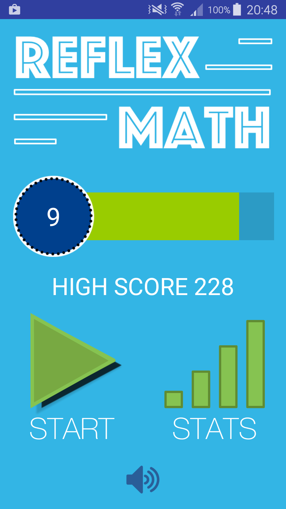
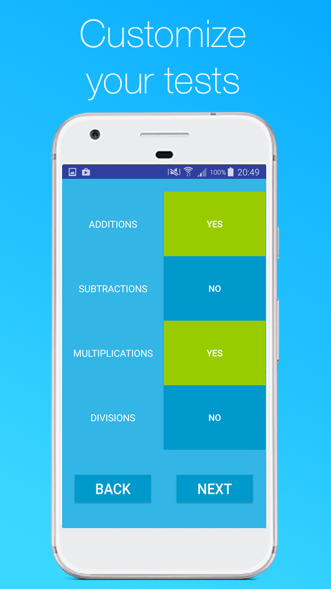
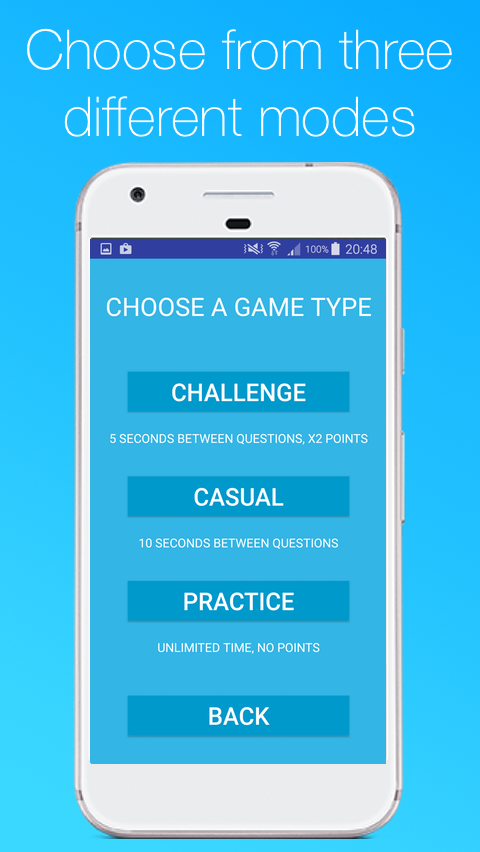
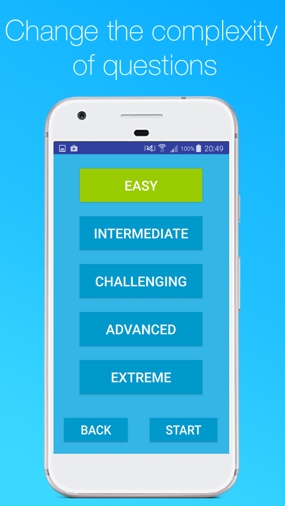
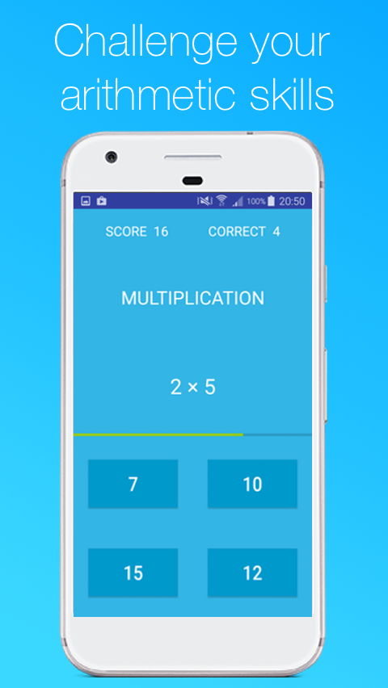
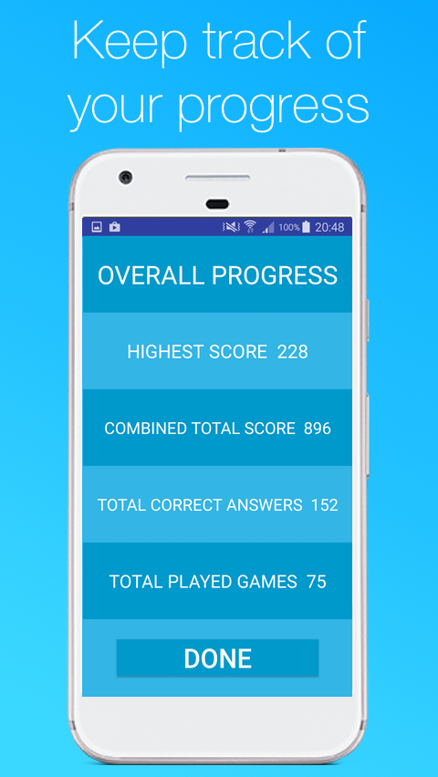

# Reflex-Math

Train yourself to perform additions, subtractions, multiplications and divisions faster!
Select a game mode, customize your tests to include only the types of math your wish to do. 

Reflex-Math is currently on the app store: https://play.google.com/store/apps/details?id=com.hbm.heathbaron_morgan.reflexmath

## Features

The player's level, xp and high score are displayed on the home screen:

The player can choose what type of math questions they want to answer.

Next, they must choose a game mode:

Finally, they can chose the complexity of the mathematical expressions.

The game page displays the players current score and the number of questions they have answered.
The answer will be on one of the four buttons on the bottom of the screen.
The time remaining for the current question is represented by a progress bar in the center of the page.

The overall progress and statistics can be viewed in the stats page.

